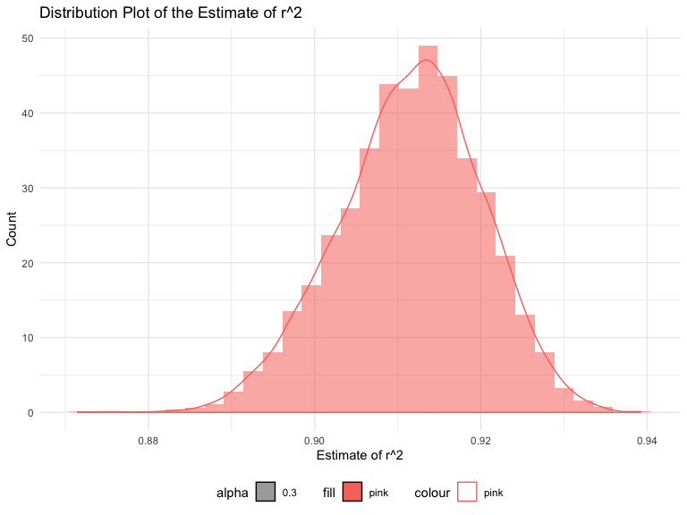
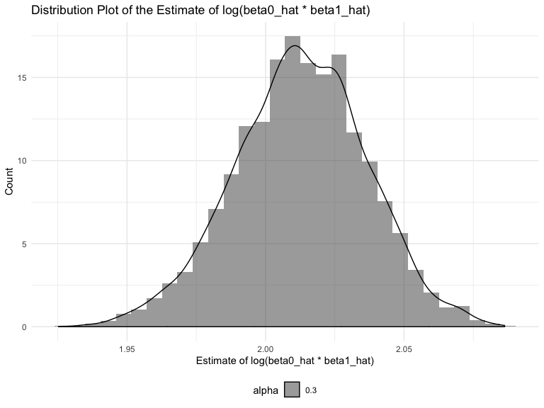

p8105\_hw6\_ys3298
================
Yimeng Shang(ys3298)
11/15/2019

# Problem 1

In this problem, you will analyze data gathered to understand the
effects of several variables on a child’s birthweight.

## load and clean data

``` r
#load
bw = read_csv("./data/birthweight.csv") %>% 
  janitor::clean_names()
```

    ## Parsed with column specification:
    ## cols(
    ##   .default = col_double()
    ## )

    ## See spec(...) for full column specifications.

``` r
# factor
bw_clean = bw %>% 
  mutate(
    babysex = factor(babysex, levels = c("1", "2"), labels = c("male", "female")),
    malform = factor(malform, levels = c("0", "1"), labels = c("absent", "present")),
    frace = factor(frace, levels = c("1", "2", "3", "4", "8", "9"), labels = c("White", "Black", "Asian", "Puerto Rican", "Other", "Unknown")),
    mrace = factor(mrace, levels = c("1", "2", "3", "4", "8"), labels = c("White", "Black", "Asian", "Puerto Rican", "Other"))
    ) %>% 
  select(bwt, everything())

# show data
bw_clean
```

    ## # A tibble: 4,342 x 20
    ##      bwt babysex bhead blength delwt fincome frace gaweeks malform menarche
    ##    <dbl> <fct>   <dbl>   <dbl> <dbl>   <dbl> <fct>   <dbl> <fct>      <dbl>
    ##  1  3629 female     34      51   177      35 White    39.9 absent        13
    ##  2  3062 male       34      48   156      65 Black    25.9 absent        14
    ##  3  3345 female     36      50   148      85 White    39.9 absent        12
    ##  4  3062 male       34      52   157      55 White    40   absent        14
    ##  5  3374 female     34      52   156       5 White    41.6 absent        13
    ##  6  3374 male       33      52   129      55 White    40.7 absent        12
    ##  7  2523 female     33      46   126      96 Black    40.3 absent        14
    ##  8  2778 female     33      49   140       5 White    37.4 absent        12
    ##  9  3515 male       36      52   146      85 White    40.3 absent        11
    ## 10  3459 male       33      50   169      75 Black    40.7 absent        12
    ## # … with 4,332 more rows, and 10 more variables: mheight <dbl>,
    ## #   momage <dbl>, mrace <fct>, parity <dbl>, pnumlbw <dbl>, pnumsga <dbl>,
    ## #   ppbmi <dbl>, ppwt <dbl>, smoken <dbl>, wtgain <dbl>

``` r
# Check missing value
sum(is.na(bw_clean)) 
```

    ## [1] 0

For missing values, there are 0 missing values.

## Propose a regression model for birthweight

### Modeling process

``` r
full_mod = lm(bwt ~ ., data = bw_clean)

BIC_mod = step (full_mod, direction = "backward",
                k = log(nrow(bw_clean)), trace = FALSE)
summary(BIC_mod)
```

    ## 
    ## Call:
    ## lm(formula = bwt ~ babysex + bhead + blength + delwt + gaweeks + 
    ##     mheight + mrace + ppwt + smoken, data = bw_clean)
    ## 
    ## Residuals:
    ##      Min       1Q   Median       3Q      Max 
    ## -1104.52  -183.71    -2.92   174.58  2336.55 
    ## 
    ## Coefficients:
    ##                     Estimate Std. Error t value Pr(>|t|)    
    ## (Intercept)       -6090.6410   137.5628 -44.275  < 2e-16 ***
    ## babysexfemale        28.9272     8.4577   3.420 0.000631 ***
    ## bhead               131.1745     3.4460  38.065  < 2e-16 ***
    ## blength              74.7285     2.0187  37.018  < 2e-16 ***
    ## delwt                 4.1053     0.3921  10.471  < 2e-16 ***
    ## gaweeks              11.4086     1.4579   7.825 6.32e-15 ***
    ## mheight               6.8133     1.7803   3.827 0.000132 ***
    ## mraceBlack         -145.4960     9.2303 -15.763  < 2e-16 ***
    ## mraceAsian          -78.1687    42.3138  -1.847 0.064764 .  
    ## mracePuerto Rican  -106.5370    19.1169  -5.573 2.66e-08 ***
    ## ppwt                 -2.6726     0.4274  -6.253 4.40e-10 ***
    ## smoken               -4.8782     0.5858  -8.327  < 2e-16 ***
    ## ---
    ## Signif. codes:  0 '***' 0.001 '**' 0.01 '*' 0.05 '.' 0.1 ' ' 1
    ## 
    ## Residual standard error: 272.5 on 4330 degrees of freedom
    ## Multiple R-squared:  0.7175, Adjusted R-squared:  0.7168 
    ## F-statistic: 999.9 on 11 and 4330 DF,  p-value: < 2.2e-16

### show a plot of model residuals against fitted values – use add\_predictions and add\_residuals in making this plot.

## Compare your model to two others

Make this comparison in terms of the cross-validated prediction error;
use crossv\_mc and functions in purrr as
appropriate.

### One using length at birth and gestational age as predictors (main effects only)

``` r
blength_gaweeks = lm(bwt ~ blength + gaweeks, data = bw_clean) 

blength_gaweeks %>% 
  broom::tidy() %>% knitr::kable()
```

| term        |     estimate | std.error |  statistic | p.value |
| :---------- | -----------: | --------: | ---------: | ------: |
| (Intercept) | \-4347.66707 | 97.958360 | \-44.38281 |       0 |
| blength     |    128.55569 |  1.989891 |   64.60439 |       0 |
| gaweeks     |     27.04673 |  1.717930 |   15.74379 |       0 |

### One using head circumference, length, sex, and all interactions (including the three-way interaction) between these

``` r
interac = lm(bwt ~ bhead + blength + babysex + bhead*blength + bhead*babysex + blength*babysex + bhead*blength*babysex, data = bw_clean) 

interac %>% broom::tidy() %>% knitr::kable()
```

| term                        |       estimate |    std.error |   statistic |   p.value |
| :-------------------------- | -------------: | -----------: | ----------: | --------: |
| (Intercept)                 | \-7176.8170221 | 1264.8397394 | \-5.6740920 | 0.0000000 |
| bhead                       |    181.7956350 |   38.0542051 |   4.7772811 | 0.0000018 |
| blength                     |    102.1269235 |   26.2118095 |   3.8962180 | 0.0000992 |
| babysexfemale               |   6374.8683508 | 1677.7669213 |   3.7996150 | 0.0001469 |
| bhead:blength               |    \-0.5536096 |    0.7802092 | \-0.7095656 | 0.4780117 |
| bhead:babysexfemale         |  \-198.3931810 |   51.0916850 | \-3.8830816 | 0.0001047 |
| blength:babysexfemale       |  \-123.7728875 |   35.1185360 | \-3.5244319 | 0.0004288 |
| bhead:blength:babysexfemale |      3.8780531 |    1.0566296 |   3.6702106 | 0.0002453 |

# Problem 2

For this problem, we’ll use the 2017 Central Park weather data that
we’ve seen elsewhere. The code chunk below (adapted from the course
website) will download these data.

``` r
weather_df = 
  rnoaa::meteo_pull_monitors(
    c("USW00094728"),
    var = c("PRCP", "TMIN", "TMAX"), 
    date_min = "2017-01-01",
    date_max = "2017-12-31") %>%
  mutate(
    name = recode(id, USW00094728 = "CentralPark_NY"),
    tmin = tmin / 10,
    tmax = tmax / 10) %>%
  select(name, id, everything())
```

    ## Registered S3 method overwritten by 'crul':
    ##   method                 from
    ##   as.character.form_file httr

    ## Registered S3 method overwritten by 'hoardr':
    ##   method           from
    ##   print.cache_info httr

    ## file path:          /Users/yimeng/Library/Caches/rnoaa/ghcnd/USW00094728.dly

    ## file last updated:  2019-09-03 20:49:09

    ## file min/max dates: 1869-01-01 / 2019-09-30

``` r
regression_df = 
  weather_df %>% 
  mutate(tmax_y = tmax, tmin_x = tmin) %>% 
  select(tmax_y, tmin_x) 
```

The boostrap is helpful when you’d like to perform inference for a
parameter / value / summary that doesn’t have an easy-to-write-down
distribution in the usual repeated sampling framework. We’ll focus on a
simple linear regression with tmax as the response and tmin as the
predictor, and are interested in the distribution of two quantities
estimated from these data:

``` r
bootstrap_results =
  regression_df %>% 
  modelr::bootstrap(n = 5000) %>% 
  mutate(
    models = map(strap, ~lm(tmax_y ~ tmin_x, data = .x) ),
    results = map(models, broom::tidy),
    variables = map(models, broom::glance)) %>% 
  select(-strap, -models) %>% 
  unnest(results,variables) 
```

## plot of r^2

``` r
# plot r^2
bootstrap_results %>% 
  filter(term == "tmin_x") %>% 
  select(r.squared, adj.r.squared) %>% 
  ggplot() + geom_histogram(aes(x = r.squared, y =..density.., alpha = 0.3, fill = "pink")) + geom_density(aes(x = r.squared,y=..density.., alpha = 0.3, color = "pink")) +
  labs(
    title = "Distribution Plot of the Estimate of r^2",
    x = "Estimate of r^2",
    y = "Count")
```

    ## `stat_bin()` using `bins = 30`. Pick better value with `binwidth`.



``` r
 # + geom_histogram(aes(x = adj.r.squared, y=..density.., alpha = 0.3, fill = "blue")) + geom_density(aes(x = adj.r.squared,y=..density.., alpha = 0.3, color = "blue"))
```

**Describe:** From the plot, we can see the estimated r^2 basically
follows a normal distribution, although have a heavier tail on the left.

## CI of r^2

``` r
# compute 95% CI for r^2
CI_r2 = 
  bootstrap_results %>% 
  filter(term == "tmin_x") %>% 
  pull(r.squared) %>% 
  quantile(c(0.025, 0.975))

CI_r2
```

    ##      2.5%     97.5% 
    ## 0.8937119 0.9272867

``` r
bootstrap_results %>% 
  filter(term == "tmin_x") %>% 
  select(r.squared, adj.r.squared) %>% 
  ggplot() + geom_histogram(aes(x = r.squared, y =..density.., alpha = 0.3, fill = "pink")) + geom_density(aes(x = r.squared,y=..density.., alpha = 0.3, color = "pink")) +
  geom_vline(aes(xintercept = CI_r2[[1]]), color = "red") +
  geom_vline(aes(xintercept = CI_r2[[2]]), color = "red") +
  labs(
    title = "Distribution Plot of the Estimate of r^2",
    x = "Estimate of r^2",
    y = "Count") 
```

    ## `stat_bin()` using `bins = 30`. Pick better value with `binwidth`.


## plot log(β̂ 0∗β̂ 1)

``` r
# compute log(β̂ 0∗β̂ 1)
# plot log(β̂ 0∗β̂ 1)

log =
  bootstrap_results %>% 
  select(.id, term, estimate) %>% 
  pivot_wider(
    id_cols = .id,
    values_from = estimate,
    names_from = term
  ) %>% 
  janitor::clean_names() %>% 
  mutate(log_value = log(intercept*tmin_x)) 

log %>% 
  ggplot() + geom_histogram(aes(x = log_value, y =..density.., alpha = 0.3)) + geom_density(aes(x = log_value, y=..density.., alpha = 0.3)) +
  labs(
    title = "Distribution Plot of the Estimate of log(beta0_hat * beta1_hat)",
    x = "Estimate of log(beta0_hat * beta1_hat)",
    y = "Count")
```

    ## `stat_bin()` using `bins = 30`. Pick better value with `binwidth`.



**Describe:** From the plot above, we can conclude that the estimated
log(β̂ 0∗β̂ 1) basically follows a normal distribution.

## 95% CI log(β̂ 0∗β̂ 1)

``` r
# compute 95% CI for log(β̂ 0∗β̂ 1)

CI_log = 
  log %>% 
  pull(log_value) %>% 
  quantile(c(0.025, 0.975))

CI_log
```

    ##     2.5%    97.5% 
    ## 1.963231 2.058303

``` r
log %>% 
  ggplot() + geom_histogram(aes(x = log_value, y =..density.., alpha = 0.3)) + geom_density(aes(x = log_value, y=..density.., alpha = 0.3)) + 
  geom_vline(aes(xintercept = CI_log[[1]]), color = "red") +
  geom_vline(aes(xintercept = CI_log[[2]]), color = "red") +
  labs(
    title = "Distribution Plot of the Estimate of log(beta0_hat * beta1_hat)",
    x = "Estimate of log(beta0_hat * beta1_hat)",
    y = "Count")
```

    ## `stat_bin()` using `bins = 30`. Pick better value with `binwidth`.


