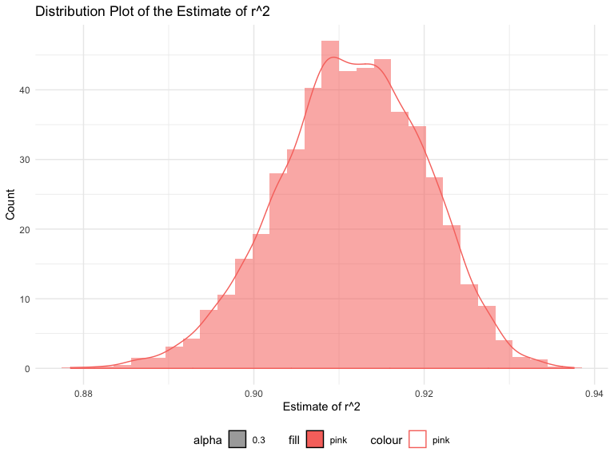

p8105\_hw6\_ys3298
================
Yimeng Shang(ys3298)
11/15/2019

# Problem 1

In this problem, you will analyze data gathered to understand the
effects of several variables on a child’s birthweight.

## load and clean data

``` r
#load
bw = read_csv("./data/birthweight.csv") %>% 
  janitor::clean_names()
```

    ## Parsed with column specification:
    ## cols(
    ##   .default = col_double()
    ## )

    ## See spec(...) for full column specifications.

``` r
# factor
bw_clean = bw %>% 
  mutate(
    babysex = factor(babysex, levels = c("1", "2"), labels = c("male", "female")),
    malform = factor(malform, levels = c("0", "1"), labels = c("absent", "present")),
    frace = factor(frace, levels = c("1", "2", "3", "4", "8", "9"), labels = c("White", "Black", "Asian", "Puerto Rican", "Other", "Unknown")),
    mrace = factor(mrace, levels = c("1", "2", "3", "4", "8"), labels = c("White", "Black", "Asian", "Puerto Rican", "Other"))
    )

# show data
bw_clean
```

    ## # A tibble: 4,342 x 20
    ##    babysex bhead blength   bwt delwt fincome frace gaweeks malform menarche
    ##    <fct>   <dbl>   <dbl> <dbl> <dbl>   <dbl> <fct>   <dbl> <fct>      <dbl>
    ##  1 female     34      51  3629   177      35 White    39.9 absent        13
    ##  2 male       34      48  3062   156      65 Black    25.9 absent        14
    ##  3 female     36      50  3345   148      85 White    39.9 absent        12
    ##  4 male       34      52  3062   157      55 White    40   absent        14
    ##  5 female     34      52  3374   156       5 White    41.6 absent        13
    ##  6 male       33      52  3374   129      55 White    40.7 absent        12
    ##  7 female     33      46  2523   126      96 Black    40.3 absent        14
    ##  8 female     33      49  2778   140       5 White    37.4 absent        12
    ##  9 male       36      52  3515   146      85 White    40.3 absent        11
    ## 10 male       33      50  3459   169      75 Black    40.7 absent        12
    ## # … with 4,332 more rows, and 10 more variables: mheight <dbl>,
    ## #   momage <dbl>, mrace <fct>, parity <dbl>, pnumlbw <dbl>, pnumsga <dbl>,
    ## #   ppbmi <dbl>, ppwt <dbl>, smoken <dbl>, wtgain <dbl>

``` r
# Check missing value
sum(is.na(bw_clean)) 
```

    ## [1] 0

For missing values, there are 0 missing values.

## Propose a regression model for birthweight

# Problem 2

For this problem, we’ll use the 2017 Central Park weather data that
we’ve seen elsewhere. The code chunk below (adapted from the course
website) will download these data.

``` r
weather_df = 
  rnoaa::meteo_pull_monitors(
    c("USW00094728"),
    var = c("PRCP", "TMIN", "TMAX"), 
    date_min = "2017-01-01",
    date_max = "2017-12-31") %>%
  mutate(
    name = recode(id, USW00094728 = "CentralPark_NY"),
    tmin = tmin / 10,
    tmax = tmax / 10) %>%
  select(name, id, everything())
```

    ## Registered S3 method overwritten by 'crul':
    ##   method                 from
    ##   as.character.form_file httr

    ## Registered S3 method overwritten by 'hoardr':
    ##   method           from
    ##   print.cache_info httr

    ## file path:          /Users/yimeng/Library/Caches/rnoaa/ghcnd/USW00094728.dly

    ## file last updated:  2019-09-03 20:49:09

    ## file min/max dates: 1869-01-01 / 2019-09-30

``` r
regression_df = 
  weather_df %>% 
  mutate(tmax_y = tmax, tmin_x = tmin) %>% 
  select(tmax_y, tmin_x) 
```

The boostrap is helpful when you’d like to perform inference for a
parameter / value / summary that doesn’t have an easy-to-write-down
distribution in the usual repeated sampling framework. We’ll focus on a
simple linear regression with tmax as the response and tmin as the
predictor, and are interested in the distribution of two quantities
estimated from these data:

``` r
bootstrap_results =
  regression_df %>% 
  modelr::bootstrap(n = 5000) %>% 
  mutate(
    models = map(strap, ~lm(tmax_y ~ tmin_x, data = .x) ),
    results = map(models, broom::tidy),
    variables = map(models, broom::glance)) %>% 
  select(-strap, -models) %>% 
  unnest(results,variables) 
```

## r^2

``` r
# plot r^2
bootstrap_results %>% 
  filter(term == "tmin_x") %>% 
  select(r.squared, adj.r.squared) %>% 
  ggplot() + geom_histogram(aes(x = r.squared, y=..density.., alpha = 0.3, fill = "pink")) + geom_density(aes(x = r.squared,y=..density.., alpha = 0.3, color = "pink")) 
```

    ## `stat_bin()` using `bins = 30`. Pick better value with `binwidth`.



``` r
 # + geom_histogram(aes(x = adj.r.squared, y=..density.., alpha = 0.3, fill = "blue")) + geom_density(aes(x = adj.r.squared,y=..density.., alpha = 0.3, color = "blue"))
```

**Describe:**

``` r
# compute 95% CI for r^2
CI_r2 = 
  bootstrap_results %>% 
  filter(term == "tmin_x") %>% 
  pull(r.squared) %>% 
  quantile(c(0.025, 0.975))

CI_r2
```

    ##      2.5%     97.5% 
    ## 0.8939171 0.9277699

## log(β̂ 0∗β̂ 1)

``` r
# plot r^2
bootstrap_results %>% 
  filter(term == "tmin_x") %>% 
  select(r.squared, adj.r.squared) %>% 
  ggplot() + geom_histogram(aes(x = r.squared, y=..density.., alpha = 0.3, fill = "pink")) + geom_density(aes(x = r.squared,y=..density.., alpha = 0.3, color = "pink")) 
```

    ## `stat_bin()` using `bins = 30`. Pick better value with `binwidth`.


``` r
 # + geom_histogram(aes(x = adj.r.squared, y=..density.., alpha = 0.3, fill = "blue")) + geom_density(aes(x = adj.r.squared,y=..density.., alpha = 0.3, color = "blue"))
```
