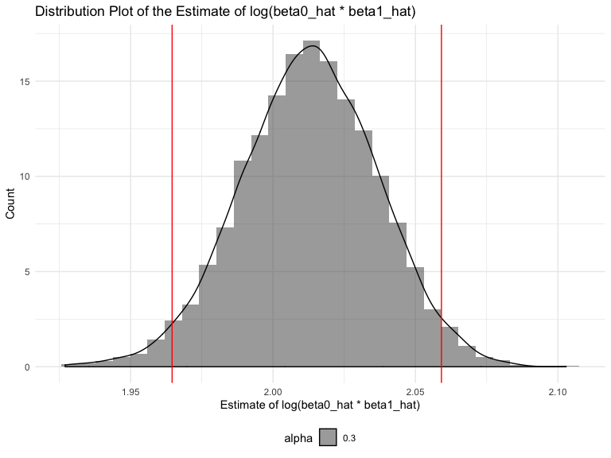

p8105\_hw6\_ys3298
================
Yimeng Shang(ys3298)
11/15/2019

# Problem 1

In this problem, you will analyze data gathered to understand the
effects of several variables on a child’s birthweight.

## load and clean data

``` r
#load
bw = read_csv("./data/birthweight.csv") %>% 
  janitor::clean_names()
```

    ## Parsed with column specification:
    ## cols(
    ##   .default = col_double()
    ## )

    ## See spec(...) for full column specifications.

``` r
# factor
bw_clean = bw %>% 
  mutate(
    babysex = factor(babysex, levels = c("1", "2"), labels = c("male", "female")),
    malform = factor(malform, levels = c("0", "1"), labels = c("absent", "present")),
    frace = factor(frace, levels = c("1", "2", "3", "4", "8", "9"), labels = c("White", "Black", "Asian", "Puerto Rican", "Other", "Unknown")),
    mrace = factor(mrace, levels = c("1", "2", "3", "4", "8"), labels = c("White", "Black", "Asian", "Puerto Rican", "Other"))
    ) %>% 
  select(bwt, everything())

# show data
bw_clean
```

    ## # A tibble: 4,342 x 20
    ##      bwt babysex bhead blength delwt fincome frace gaweeks malform menarche
    ##    <dbl> <fct>   <dbl>   <dbl> <dbl>   <dbl> <fct>   <dbl> <fct>      <dbl>
    ##  1  3629 female     34      51   177      35 White    39.9 absent        13
    ##  2  3062 male       34      48   156      65 Black    25.9 absent        14
    ##  3  3345 female     36      50   148      85 White    39.9 absent        12
    ##  4  3062 male       34      52   157      55 White    40   absent        14
    ##  5  3374 female     34      52   156       5 White    41.6 absent        13
    ##  6  3374 male       33      52   129      55 White    40.7 absent        12
    ##  7  2523 female     33      46   126      96 Black    40.3 absent        14
    ##  8  2778 female     33      49   140       5 White    37.4 absent        12
    ##  9  3515 male       36      52   146      85 White    40.3 absent        11
    ## 10  3459 male       33      50   169      75 Black    40.7 absent        12
    ## # … with 4,332 more rows, and 10 more variables: mheight <dbl>,
    ## #   momage <dbl>, mrace <fct>, parity <dbl>, pnumlbw <dbl>, pnumsga <dbl>,
    ## #   ppbmi <dbl>, ppwt <dbl>, smoken <dbl>, wtgain <dbl>

``` r
# Check missing value
sum(is.na(bw_clean)) 
```

    ## [1] 0

For missing values, there are 0 missing values.

## Propose a regression model for birthweight

### Modeling process

#### Full model

``` r
full_mod = lm(bwt ~ ., data = bw_clean)
summary(full_mod)
```

    ## 
    ## Call:
    ## lm(formula = bwt ~ ., data = bw_clean)
    ## 
    ## Residuals:
    ##      Min       1Q   Median       3Q      Max 
    ## -1097.68  -184.86    -3.33   173.09  2344.15 
    ## 
    ## Coefficients: (3 not defined because of singularities)
    ##                     Estimate Std. Error t value Pr(>|t|)    
    ## (Intercept)       -6265.3914   660.4011  -9.487  < 2e-16 ***
    ## babysexfemale        28.7073     8.4652   3.391 0.000702 ***
    ## bhead               130.7781     3.4523  37.881  < 2e-16 ***
    ## blength              74.9536     2.0217  37.075  < 2e-16 ***
    ## delwt                 4.1007     0.3948  10.386  < 2e-16 ***
    ## fincome               0.2898     0.1795   1.614 0.106551    
    ## fraceBlack           14.3313    46.1501   0.311 0.756168    
    ## fraceAsian           21.2361    69.2960   0.306 0.759273    
    ## fracePuerto Rican   -46.9962    44.6782  -1.052 0.292912    
    ## fraceOther            4.2969    74.0741   0.058 0.953745    
    ## gaweeks              11.5494     1.4654   7.882 4.06e-15 ***
    ## malformpresent        9.7650    70.6259   0.138 0.890039    
    ## menarche             -3.5508     2.8951  -1.226 0.220083    
    ## mheight               9.7874    10.3116   0.949 0.342588    
    ## momage                0.7593     1.2221   0.621 0.534418    
    ## mraceBlack         -151.4354    46.0453  -3.289 0.001014 ** 
    ## mraceAsian          -91.3866    71.9190  -1.271 0.203908    
    ## mracePuerto Rican   -56.4787    45.1369  -1.251 0.210901    
    ## parity               95.5411    40.4793   2.360 0.018307 *  
    ## pnumlbw                   NA         NA      NA       NA    
    ## pnumsga                   NA         NA      NA       NA    
    ## ppbmi                 4.3538    14.8913   0.292 0.770017    
    ## ppwt                 -3.4716     2.6121  -1.329 0.183913    
    ## smoken               -4.8544     0.5871  -8.269  < 2e-16 ***
    ## wtgain                    NA         NA      NA       NA    
    ## ---
    ## Signif. codes:  0 '***' 0.001 '**' 0.01 '*' 0.05 '.' 0.1 ' ' 1
    ## 
    ## Residual standard error: 272.5 on 4320 degrees of freedom
    ## Multiple R-squared:  0.7183, Adjusted R-squared:  0.717 
    ## F-statistic: 524.6 on 21 and 4320 DF,  p-value: < 2.2e-16

``` r
full_mod %>% broom::tidy() %>% knitr::kable()
```

| term              |       estimate |   std.error |   statistic |   p.value |
| :---------------- | -------------: | ----------: | ----------: | --------: |
| (Intercept)       | \-6265.3914076 | 660.4010631 | \-9.4872522 | 0.0000000 |
| babysexfemale     |     28.7073088 |   8.4652447 |   3.3911966 | 0.0007021 |
| bhead             |    130.7781455 |   3.4523248 |  37.8811826 | 0.0000000 |
| blength           |     74.9535780 |   2.0216656 |  37.0751613 | 0.0000000 |
| delwt             |      4.1007326 |   0.3948202 |  10.3863301 | 0.0000000 |
| fincome           |      0.2898207 |   0.1795416 |   1.6142265 | 0.1065513 |
| fraceBlack        |     14.3312853 |  46.1501283 |   0.3105362 | 0.7561682 |
| fraceAsian        |     21.2361118 |  69.2959907 |   0.3064551 | 0.7592729 |
| fracePuerto Rican |   \-46.9962310 |  44.6782159 | \-1.0518824 | 0.2929123 |
| fraceOther        |      4.2969242 |  74.0740827 |   0.0580085 | 0.9537446 |
| gaweeks           |     11.5493872 |   1.4653680 |   7.8815609 | 0.0000000 |
| malformpresent    |      9.7649680 |  70.6258929 |   0.1382633 | 0.8900388 |
| menarche          |    \-3.5507723 |   2.8950777 | \-1.2264860 | 0.2200827 |
| mheight           |      9.7874130 |  10.3115672 |   0.9491683 | 0.3425881 |
| momage            |      0.7593479 |   1.2221417 |   0.6213256 | 0.5344182 |
| mraceBlack        |  \-151.4354038 |  46.0453432 | \-3.2888321 | 0.0010141 |
| mraceAsian        |   \-91.3866079 |  71.9189677 | \-1.2706885 | 0.2039079 |
| mracePuerto Rican |   \-56.4787268 |  45.1368828 | \-1.2512766 | 0.2109013 |
| parity            |     95.5411137 |  40.4792711 |   2.3602479 | 0.0183069 |
| ppbmi             |      4.3537865 |  14.8913292 |   0.2923706 | 0.7700173 |
| ppwt              |    \-3.4715550 |   2.6121254 | \-1.3290155 | 0.1839131 |
| smoken            |    \-4.8543629 |   0.5870549 | \-8.2690107 | 0.0000000 |

Firstly, I put all variables into consideration to establish a full
model for linear regression. From the result, I noticed that there are
lots of variables is not significant, which means that we can not reject
the hypothesis that slopes of these variables is not equal to zero, ie
the effect of these variables on the outcome can be ignored. Thus, there
are some redundant variables in the full model, which makes it a not so
good model.

#### BIC model

``` r
BIC_mod = step(full_mod, direction = "backward",
                k = log(nrow(bw_clean)), trace = FALSE)
summary(BIC_mod)
```

    ## 
    ## Call:
    ## lm(formula = bwt ~ babysex + bhead + blength + delwt + gaweeks + 
    ##     mheight + mrace + ppwt + smoken, data = bw_clean)
    ## 
    ## Residuals:
    ##      Min       1Q   Median       3Q      Max 
    ## -1104.52  -183.71    -2.92   174.58  2336.55 
    ## 
    ## Coefficients:
    ##                     Estimate Std. Error t value Pr(>|t|)    
    ## (Intercept)       -6090.6410   137.5628 -44.275  < 2e-16 ***
    ## babysexfemale        28.9272     8.4577   3.420 0.000631 ***
    ## bhead               131.1745     3.4460  38.065  < 2e-16 ***
    ## blength              74.7285     2.0187  37.018  < 2e-16 ***
    ## delwt                 4.1053     0.3921  10.471  < 2e-16 ***
    ## gaweeks              11.4086     1.4579   7.825 6.32e-15 ***
    ## mheight               6.8133     1.7803   3.827 0.000132 ***
    ## mraceBlack         -145.4960     9.2303 -15.763  < 2e-16 ***
    ## mraceAsian          -78.1687    42.3138  -1.847 0.064764 .  
    ## mracePuerto Rican  -106.5370    19.1169  -5.573 2.66e-08 ***
    ## ppwt                 -2.6726     0.4274  -6.253 4.40e-10 ***
    ## smoken               -4.8782     0.5858  -8.327  < 2e-16 ***
    ## ---
    ## Signif. codes:  0 '***' 0.001 '**' 0.01 '*' 0.05 '.' 0.1 ' ' 1
    ## 
    ## Residual standard error: 272.5 on 4330 degrees of freedom
    ## Multiple R-squared:  0.7175, Adjusted R-squared:  0.7168 
    ## F-statistic: 999.9 on 11 and 4330 DF,  p-value: < 2.2e-16

``` r
BIC_mod %>% broom::tidy() %>% knitr::kable()
```

| term              |      estimate |   std.error |   statistic |   p.value |
| :---------------- | ------------: | ----------: | ----------: | --------: |
| (Intercept)       | \-6090.640959 | 137.5627901 | \-44.275352 | 0.0000000 |
| babysexfemale     |     28.927218 |   8.4576787 |    3.420231 | 0.0006315 |
| bhead             |    131.174549 |   3.4460335 |   38.065373 | 0.0000000 |
| blength           |     74.728511 |   2.0186820 |   37.018465 | 0.0000000 |
| delwt             |      4.105313 |   0.3920650 |   10.471002 | 0.0000000 |
| gaweeks           |     11.408645 |   1.4579351 |    7.825208 | 0.0000000 |
| mheight           |      6.813279 |   1.7803370 |    3.826960 | 0.0001316 |
| mraceBlack        |  \-145.495954 |   9.2303009 | \-15.762861 | 0.0000000 |
| mraceAsian        |   \-78.168678 |  42.3138236 |  \-1.847356 | 0.0647638 |
| mracePuerto Rican |  \-106.537047 |  19.1168869 |  \-5.572929 | 0.0000000 |
| ppwt              |    \-2.672565 |   0.4273757 |  \-6.253433 | 0.0000000 |
| smoken            |    \-4.878211 |   0.5857973 |  \-8.327474 | 0.0000000 |

Because we only have a little knowledge about the study and base on
hyphothesis may cause bias and depended too much on s ubjectivity. So I
used data-driven method called Bayesian information criterion.

BIC is a criterion for model selection among a finite set of models. The
models can be tested using corresponding BIC values. Lower BIC value
indicates lower penalty terms hence a better model. In R, there’s a
function ‘step’ to do this process.

From the result above, baby’s sex, baby’s head circumference at birth,
baby’s length at birth, mother’s weight at delivery, gestational age in
weeks, mother’s height, mother’s race, mother’s pre-pregnancy weight and
average nomberof cigarettes smoked per day during pregnancy have
significant influence on the baby’s birth weight. In detail, female
baby, head, length, mother’s weight at delivery, gestational age in
weeks and mother’s height have a positive effect on the baby’s weight
(baby tend to my heavier with increase of these factors.). And, mothers
are Black, Asian, Puerto Rican tend to have less heavy baby. Mother’s
pre-pregnancy weight and average nomberof cigarettes smoked per day
during pregnancy have a negative effect on baby’s
weight.

### show a plot of model residuals against fitted values – use add\_predictions and add\_residuals in making this plot.

``` r
bw_clean %>% 
  add_residuals(BIC_mod) %>% 
  add_predictions(BIC_mod) %>% 
  ggplot(aes(x = pred, y = resid)) + geom_point(color = "pink") + geom_line( y = 0, color = "red") +
  labs(
    x = "Fitted Values",
    y = "Residuals",
    title = "Residuals vs Fitted Values"
  ) 
```


## Compare your model to two others

Make this comparison in terms of the cross-validated prediction error;
use crossv\_mc and functions in purrr as
appropriate.

### One using length at birth and gestational age as predictors (main effects only)

``` r
main_mod = lm(bwt ~ blength + gaweeks, data = bw_clean) 

main_mod %>% 
  broom::tidy() %>% knitr::kable()
```

| term        |     estimate | std.error |  statistic | p.value |
| :---------- | -----------: | --------: | ---------: | ------: |
| (Intercept) | \-4347.66707 | 97.958360 | \-44.38281 |       0 |
| blength     |    128.55569 |  1.989891 |   64.60439 |       0 |
| gaweeks     |     27.04673 |  1.717930 |   15.74379 |       0 |

### One using head circumference, length, sex, and all interactions (including the three-way interaction) between these

``` r
interaction_mod = lm(bwt ~ bhead + blength + babysex + bhead*blength + bhead*babysex + blength*babysex + bhead*blength*babysex, data = bw_clean) 

interaction_mod %>% broom::tidy() %>% knitr::kable()
```

| term                        |       estimate |    std.error |   statistic |   p.value |
| :-------------------------- | -------------: | -----------: | ----------: | --------: |
| (Intercept)                 | \-7176.8170221 | 1264.8397394 | \-5.6740920 | 0.0000000 |
| bhead                       |    181.7956350 |   38.0542051 |   4.7772811 | 0.0000018 |
| blength                     |    102.1269235 |   26.2118095 |   3.8962180 | 0.0000992 |
| babysexfemale               |   6374.8683508 | 1677.7669213 |   3.7996150 | 0.0001469 |
| bhead:blength               |    \-0.5536096 |    0.7802092 | \-0.7095656 | 0.4780117 |
| bhead:babysexfemale         |  \-198.3931810 |   51.0916850 | \-3.8830816 | 0.0001047 |
| blength:babysexfemale       |  \-123.7728875 |   35.1185360 | \-3.5244319 | 0.0004288 |
| bhead:blength:babysexfemale |      3.8780531 |    1.0566296 |   3.6702106 | 0.0002453 |

### Cross validation

``` r
cv_df =
  crossv_mc(bw_clean, 100) %>% 
  mutate(
    train = map(train, as_tibble),
    test = map(test, as_tibble)) %>% 
  mutate(BIC_mod = map(train, ~BIC_mod),
         main_effect = map(train, ~main_mod),
         interaction = map(train, ~interaction_mod)) %>% 
  mutate(rmse_BIC = map2_dbl(BIC_mod, test, ~rmse(model = .x, data = .y)),
         rmse_main= map2_dbl(main_effect, test, ~rmse(model = .x, data = .y)),
         rmse_interaction = map2_dbl(interaction, test, ~rmse(model = .x, data = .y))
         )

cv_df %>% 
  select(starts_with("rmse")) %>% 
  pivot_longer(
    everything(),
    names_to = "model", 
    values_to = "rmse",
    names_prefix = "rmse_") %>% 
  mutate(model = fct_inorder(model)) %>% 
  ggplot(aes(x = model, y = rmse, fill = model, alpha = 0.5)) + geom_violin()
```


From the plot, we noticed that the rmse for model only consider the main
effects are pretty high. The model consider interactions are relatively
high compared with the BIC model, which means the BIC model is good
compared to these two.

# Problem 2

For this problem, we’ll use the 2017 Central Park weather data that
we’ve seen elsewhere. The code chunk below (adapted from the course
website) will download these data.

``` r
weather_df = 
  rnoaa::meteo_pull_monitors(
    c("USW00094728"),
    var = c("PRCP", "TMIN", "TMAX"), 
    date_min = "2017-01-01",
    date_max = "2017-12-31") %>%
  mutate(
    name = recode(id, USW00094728 = "CentralPark_NY"),
    tmin = tmin / 10,
    tmax = tmax / 10) %>%
  select(name, id, everything())
```

    ## Registered S3 method overwritten by 'crul':
    ##   method                 from
    ##   as.character.form_file httr

    ## Registered S3 method overwritten by 'hoardr':
    ##   method           from
    ##   print.cache_info httr

    ## file path:          /Users/yimeng/Library/Caches/rnoaa/ghcnd/USW00094728.dly

    ## file last updated:  2019-09-03 20:49:09

    ## file min/max dates: 1869-01-01 / 2019-09-30

``` r
regression_df = 
  weather_df %>% 
  mutate(tmax_y = tmax, tmin_x = tmin) %>% 
  select(tmax_y, tmin_x) 
```

The boostrap is helpful when you’d like to perform inference for a
parameter / value / summary that doesn’t have an easy-to-write-down
distribution in the usual repeated sampling framework. We’ll focus on a
simple linear regression with tmax as the response and tmin as the
predictor, and are interested in the distribution of two quantities
estimated from these data:

``` r
bootstrap_results =
  regression_df %>% 
  modelr::bootstrap(n = 5000) %>% 
  mutate(
    models = map(strap, ~lm(tmax_y ~ tmin_x, data = .x) ),
    results = map(models, broom::tidy),
    variables = map(models, broom::glance)) %>% 
  select(-strap, -models) %>% 
  unnest(results,variables) 
```

## plot of r^2

``` r
# plot r^2
bootstrap_results %>% 
  filter(term == "tmin_x") %>% 
  select(r.squared, adj.r.squared) %>% 
  ggplot() + geom_histogram(aes(x = r.squared, y =..density.., alpha = 0.3, fill = "pink")) + geom_density(aes(x = r.squared,y=..density.., alpha = 0.3, color = "pink")) +
  labs(
    title = "Distribution Plot of the Estimate of r^2",
    x = "Estimate of r^2",
    y = "Count")
```

    ## `stat_bin()` using `bins = 30`. Pick better value with `binwidth`.


**Describe:** From the plot, we can see the estimated r^2 basically
follows a normal distribution, although have a heavier tail on the left.

## CI of r^2

``` r
# compute 95% CI for r^2
CI_r2 = 
  bootstrap_results %>% 
  filter(term == "tmin_x") %>% 
  pull(r.squared) %>% 
  quantile(c(0.025, 0.975))

CI_r2
```

    ##      2.5%     97.5% 
    ## 0.8944617 0.9276645

``` r
bootstrap_results %>% 
  filter(term == "tmin_x") %>% 
  select(r.squared, adj.r.squared) %>% 
  ggplot() + geom_histogram(aes(x = r.squared, y =..density.., alpha = 0.3, fill = "pink")) + geom_density(aes(x = r.squared,y=..density.., alpha = 0.3, color = "pink")) +
  geom_vline(aes(xintercept = CI_r2[[1]]), color = "red") +
  geom_vline(aes(xintercept = CI_r2[[2]]), color = "red") +
  labs(
    title = "Distribution Plot of the Estimate of r^2",
    x = "Estimate of r^2",
    y = "Count") 
```

    ## `stat_bin()` using `bins = 30`. Pick better value with `binwidth`.


## plot log(β̂ 0∗β̂ 1)

``` r
# compute log(β̂ 0∗β̂ 1)
# plot log(β̂ 0∗β̂ 1)

log =
  bootstrap_results %>% 
  select(.id, term, estimate) %>% 
  pivot_wider(
    id_cols = .id,
    values_from = estimate,
    names_from = term
  ) %>% 
  janitor::clean_names() %>% 
  mutate(log_value = log(intercept*tmin_x)) 

log %>% 
  ggplot() + geom_histogram(aes(x = log_value, y =..density.., alpha = 0.3)) + geom_density(aes(x = log_value, y=..density.., alpha = 0.3)) +
  labs(
    title = "Distribution Plot of the Estimate of log(beta0_hat * beta1_hat)",
    x = "Estimate of log(beta0_hat * beta1_hat)",
    y = "Count")
```

    ## `stat_bin()` using `bins = 30`. Pick better value with `binwidth`.


**Describe:** From the plot above, we can conclude that the estimated
log(β̂ 0∗β̂ 1) basically follows a normal distribution.

## 95% CI log(β̂ 0∗β̂ 1)

``` r
# compute 95% CI for log(β̂ 0∗β̂ 1)

CI_log = 
  log %>% 
  pull(log_value) %>% 
  quantile(c(0.025, 0.975))

CI_log
```

    ##     2.5%    97.5% 
    ## 1.965895 2.058558

``` r
log %>% 
  ggplot() + geom_histogram(aes(x = log_value, y =..density.., alpha = 0.3)) + geom_density(aes(x = log_value, y=..density.., alpha = 0.3)) + 
  geom_vline(aes(xintercept = CI_log[[1]]), color = "red") +
  geom_vline(aes(xintercept = CI_log[[2]]), color = "red") +
  labs(
    title = "Distribution Plot of the Estimate of log(beta0_hat * beta1_hat)",
    x = "Estimate of log(beta0_hat * beta1_hat)",
    y = "Count")
```

    ## `stat_bin()` using `bins = 30`. Pick better value with `binwidth`.


